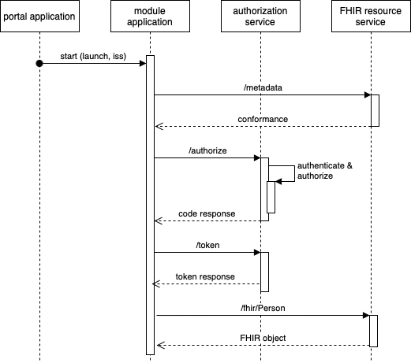

# SMART-HTI-On-FHIR

## Introduction

Both SMART App Launch Framework and HTI are standards that implement similar use cases. In the context of koppeltaal
2.0, both standards are observed as competing and mutually exclusive. This SMART-HTI-On-FHIR proposal shows that both
technologies are mutually inclusive. Evenmore, both technologies can be used in conjunction with each other, and even
take away limitations.

### The Use Cases

Both SMART App Launch Framework and HTI have similar use cases. The intention of both is to start e-health modules from
a portal like environment.

The SMART App Launch Framework starts applications from one application in the same health context to another
application in the same health context, whereas HTI is designed to be able to work between non-health and health
contexts. The SMART App Launch Framework provides access to a FHIR resource service, and HTI only supports this as a
profile. The HTI token contains all the information necessary to start an health application, with SMART App Launch
Framework the launch context can be passed provided by the authorization service.

## What is the SMART App Launch Framework?

The SMART App Launch Framework is designed around OAuth 2.0 and a FHIR resource server. The launch consists as set of
parameters. One of these parameters is a launch token. The launch token is used in the subsequent OAuth 2.0 flow to
correlate the launch with the launch context.

The SMART App Launch Framework allows launching applications to:

- Start a session on a module application
- Share resources via a FHIR resource service
- If the authorization service and the launching service are the same or are able to communicate; provide context to the
  launching application.

In brief the launch procedure looks like this:

- The launching platform redirects to the module application with a launch token (launch) and an issuer (iss).
- The module application looks up the conformance statement of the issuer (iss). The conformance statement contains the
  authorization and token URL.
- The module application redirects the user to the authorization URL with the launch token, the user is authenticated
  and authorized and returns with a code.
- The module application requests an access token with the corresponding code and credentials at the token endpoint of
  the authorization service. The response contains an access token, refresh token, and optionally some context
  parameters, such as the patient identifier (id) and treatment identifier (id).
- The module application can now access the FHIR resource service with the access token.

For more information about SMART on FHIR Application Launch Framework please take a look at
the [SMART on FHIR Application Launch Framework documentation](https://hl7.org/fhir/smart-app-launch/).

## Limitations

The main limitation of the SMART on FHIR Application Launch Framework is that the context information (such as logged in
user, desired activity for the launch) can be provided at the end of the OAuth2.0 authentication sequence, however, that
would require the OAuth2.0 authorization module to have access to that information. In the case where the authorization
module is independent of the launching application, there needs to be developed a custom method for exchanging that
information with the launching platform. Also, in an architecture where multiple portal applications can launch modules,
the OAuth2.0 authorization module needs to know where to find the portal application to query the requiered information.

## What is Health Tools Interoperability (HTI)

HTI is designed as simple and easy to implement launch protocol based on FHIR and JWT. The HTI standard defines a launch
token as JWT token that contains the smallest set information needed for a successful launch to a module application.
HTI makes use of existing technologies and standards like JWT and FHIR.

The HTI standard allows applications to:

- Start a session on a module application
- Launch applications secure and with a privacy first approach
- Exchange the FHIR task with information about the activity and the user

In brief the launch procedure looks like this:

- The portal application generates a JWT token with a JSON serialized FHIR task.
- The portal application redirects the user agent to the module application with the JWT token
- The module application validates and unpacks the token.
- The module application can now proceed and choose to use the used identofiction of the launch or identify the user
  itself.

### Limitations

HTI is developed as a lightweight standard, the exchange of FHIR resources is defined as an additional profile (HTI:
smart_on_fhir). Module applications that want to update status information of the task need to be make use of the
profile in order to do so.

## SMART HTI on FHIR: HTI and SMART on FHIR are complimentary technologies

The approach of SMART HTI on FHIR is to integrate both technologies seamlessly. The SMART App Launch Framework defines
the launch parameter to be associated with the launch, and does not define the contents of the launch parameter. HTI
only defines the contents of the launch parameter and allows for different interactions between and after the launch
sequence. Both technologies can be integrated without effecting each other. The approach of SMART HTI on FHIR is:

*SMART HTI on FHIR proposes to use the HTI token as launch parameter in the SMART App Launch Framework launch. Thereby
both technologies become complimentary.*

Main advantages of this approach is:

- SMART App Launch Framework modules keep on working "as is", without any modification to the implementation.
- HTI based modules keep on working "as is", without any modification to the implementation.
- The SMART App Launch Framework can communicate the context of the launch via the HTI token, a custom solution is no
  longer required. The HTI token *becomes* the way of communicating contextual information. A direct connection with -
  or discovery of - the launching portal is no longer required.

Main impact of this approach
- Launching platforms should populate the launch token with a valid HTI launch token
- The authorization service in the OAuth 2.0 sequence should populate the context with the attributes from the HTI 
  token.  

In brief the launch procedure looks like this:
- The portal application generates a JWT token with a JSON serialized FHIR task.
- The launching platform redirects to the module application with the HTI token as the launch token (launch) and an 
  issuer (iss).
- The module application can choose to validate the HTI launch token and start the application. In this case the 
  flow endes here. If the module application chooses to continue with the SMART App Launch Framework, the flow 
  continues with the next steps.
- The module application looks up the conformance statement of the issuer (iss). The conformance statement contains the
  authorization and token URL.
- The module application redirects the user to the authorization URL with the launch token, the user is authenticated
  and authorized and returns with a code.
- The module application requests an access token with the corresponding code and credentials at the token endpoint of
  the authorization service. The response contains an access token, refresh token, and the context
  parameters extracted from the HTI token.
- The module application can now access the FHIR resource service with the access token.

